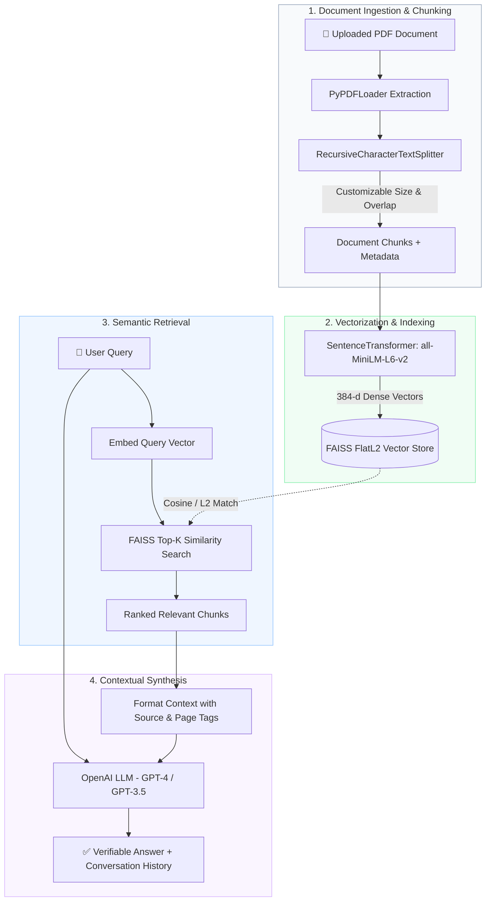

<div align="center">

# 🧠 DocuMind AI
### *High-Performance Retrieval-Augmented Generation (RAG) Document Assistant*

[](https://www.python.org/)
[](https://streamlit.io/)
[](https://www.langchain.com/)
[](https://github.com/facebookresearch/faiss)
[](LICENSE)
[](CONTRIBUTING.md)

<p align="center">
  <b>Transform static PDFs into an interactive, conversational knowledge base with grounded citations and zero hallucinations.</b>
</p>

[Key Features](#-key-features) •
[Architecture](#-system-architecture) •
[Quickstart](#-quickstart-guide) •
[Configuration](#-configuration) •
[Testing](#-testing--code-quality) •
[Roadmap](#-roadmap)

</div>

---

## 🌟 Overview

**DocuMind AI** is an intelligent, production-ready document assistant engineered with **Retrieval-Augmented Generation (RAG)**. It bridges the gap between unstructured PDF documents and LLM reasoning by dynamically segmenting documents, generating high-density vector embeddings, and conducting sub-millisecond semantic similarity search.

Whether querying research publications, financial summaries, legal documentation, or technical manuals, DocuMind AI retrieves the most pertinent context to deliver factual, grounded responses directly from your files.

---

## ⚡ Key Features

- 📄 **Multi-Document Ingestion**: Fast PDF extraction and text normalization with automatic metadata tagging (file source, page numbers).
- 🧩 **Dynamic Parameterized Chunking**: Real-time adjustment of chunk size (100–2,000 chars) and overlap (0–500 chars) to adapt to diverse document formats.
- ⚡ **Blazing-Fast Local Vector Index**: Built on **FAISS (Facebook AI Similarity Search)** for high-throughput, low-latency $L_2$ distance search.
- 🧬 **Local Dense Embeddings**: Embeddings generated locally via `sentence-transformers/all-MiniLM-L6-v2`—minimizing external API costs and latency.
- 🤖 **Context-Grounded Synthesis**: Leverages OpenAI models instructed with strict grounding constraints to eliminate hallucinations.
- 💬 **Multi-Turn Conversation History**: Retains question-and-answer pairs across the active session for seamless follow-up inquiries.
- 🔒 **Privacy-First Architecture**: Uploaded PDF files are unlinked from disk immediately after processing; embeddings are maintained in session memory.
- 📊 **Real-Time Analytics & Telemetry**: Live metrics showing active documents, total indexed chunks, and file size metrics.

---

## 🏗️ System Architecture

DocuMind AI decouples document processing, semantic indexing, and conversational generation into a clean, modular pipeline:



---

## 📂 Project Structure

```bash
DocuMind_ai/
├── app.py                   # Streamlit web application & UI components
├── rag.py                   # RAG engine (query orchestration & LLM synthesis)
├── document_processor.py    # PDF extraction, parsing, and character chunking
├── vector_store.py          # FAISS index management & SentenceTransformer embeddings
├── create_sample.py         # Utility script to generate sample test PDFs
├── conftest.py              # Root pytest test configuration
├── tests/                   # Comprehensive unit & integration test suite
│   ├── test_app.py
│   ├── test_document_processor.py
│   ├── test_rag.py
│   └── test_vector_store.py
├── requirements.txt         # Production dependencies
├── requirements-dev.txt     # Development and testing dependencies
├── setup.py                 # Package setup and metadata
├── .env.example             # Template for required environment variables
├── .gitignore               # Ignored cache, secrets, and environment artifacts
├── LICENSE                  # MIT Open Source License
└── CONTRIBUTING.md          # Contribution workflow guidelines
```

---

## 🚀 Quickstart Guide

### Prerequisites

- **Python**: `3.10` or higher recommended
- **OpenAI API Key**: Obtainable from [OpenAI Platform](https://platform.openai.com/api-keys)

### 1. Clone the Repository

```bash
git clone https://github.com/sarthak-takle/DocuMind_ai.git
cd DocuMind_ai
```

### 2. Set Up a Virtual Environment

**On Windows (PowerShell):**
```powershell
python -m venv venv
.\venv\Scripts\Activate.ps1
```

**On macOS / Linux:**
```bash
python3 -m venv venv
source venv/bin/activate
```

### 3. Install Dependencies

```bash
# Core application dependencies
pip install -r requirements.txt

# Development & test dependencies (optional)
pip install -r requirements-dev.txt
```

### 4. Configure Environment Variables

Create a `.env` file in the project root by copying the template:

```bash
cp .env.example .env
```

Open `.env` and add your OpenAI API key:

```ini
OPENAI_API_KEY=sk-your-openai-api-key-here
```

### 5. Launch the Application

```bash
streamlit run app.py
```

The application will be accessible at `http://localhost:8501`.

---

## 📖 Usage Walkthrough

1. **Upload Document**: Use the sidebar to upload any standard PDF.
2. **Adjust Indexing Parameters (Optional)**:
   - `Chunk Size`: Determines the length of individual context snippets (default: `1000`).
   - `Chunk Overlap`: Preserves sentence boundary continuity across segments (default: `200`).
3. **Index Document**: Click **"🚀 Process & Embed"** to parse pages, compute embeddings, and build the FAISS index.
4. **Interact**: Ask questions in natural language. The assistant retrieves relevant passages and composes a concise answer.
5. **Inspect & Manage**: Monitor active documents, review conversation history, or clear memory with **"🗑️ Reset Knowledge Base"**.

---

## ⚙️ Configuration

| Parameter | Default | Description |
| :--- | :--- | :--- |
| `OPENAI_API_KEY` | *None* | OpenAI API authentication key (Required) |
| `CHUNK_SIZE` | `1000` | Target length (characters) for document text segments |
| `CHUNK_OVERLAP` | `200` | Overlapping characters between adjacent segments |
| `EMBEDDING_MODEL`| `all-MiniLM-L6-v2` | SentenceTransformers model for dense embedding generation |
| `TOP_K` | `4` | Number of most similar chunks passed to LLM context |
| `TEMPERATURE` | `0.7` | LLM generation randomness (lower = more deterministic) |

---

## 🧪 Testing & Code Quality

The codebase includes a full automated test suite with mocking for API calls and file processing.

```bash
# Run all unit and integration tests
pytest

# Run tests with code coverage report
pytest --cov=. --cov-report=term-missing

# Code formatting
black .

# Static type analysis
mypy .

# Style linting
flake8 .
```

---

## 🛠️ Technology Stack

| Component | Library / Tool | Purpose |
| :--- | :--- | :--- |
| **Frontend UI** | [Streamlit](https://streamlit.io/) | Reactive web application interface |
| **RAG Orchestration** | [LangChain](https://www.langchain.com/) | Prompt management & document schema |
| **Vector Search** | [FAISS](https://github.com/facebookresearch/faiss) | In-memory similarity search |
| **Embeddings** | [Sentence Transformers](https://www.sbert.net/) | Dense 384-dimensional vector embeddings |
| **LLM Provider** | [OpenAI API](https://openai.com/) | Natural language generation |
| **PDF Extraction** | [PyPDF](https://pypdf.readthedocs.io/) | Fast PDF document parsing |

---

## 🗺️ Roadmap

- [ ] **Hybrid Search**: Combine BM25 sparse keyword search with dense vector similarity.
- [ ] **Multi-Model Support**: Add local inference support via [Ollama](https://ollama.com/) (Llama 3, Mistral).
- [ ] **Citation Highlighting**: Direct visual bounding boxes on source PDF pages.
- [ ] **Batch Processing**: Parallel multi-file upload and bulk vector indexing.
- [ ] **Persistent Index Export**: Export and re-load pre-built FAISS indices to disk.

---

## 🤝 Contributing

Contributions are welcome! Please review [CONTRIBUTING.md](CONTRIBUTING.md) for our code of conduct and pull request guidelines.

1. Fork the Project
2. Create your Feature Branch (`git checkout -b feature/AmazingFeature`)
3. Commit your Changes (`git commit -m 'feat: add AmazingFeature'`)
4. Push to the Branch (`git push origin feature/AmazingFeature`)
5. Open a Pull Request

---

## 📄 License

Distributed under the MIT License. See [LICENSE](LICENSE) for more information.
